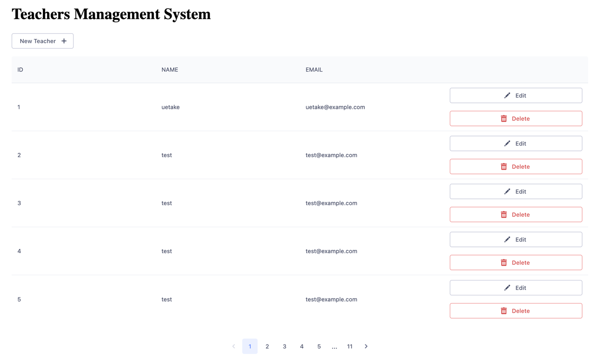

# Spring Teachers System
[System with CRUD operation for Teacher](https://spring-teachers-system.vercel.app)

## Getting Started
### Back End
1. ``cd backend``
2. ``Start Spring Boot Application``
3. ``http://localhost:8080/swagger-ui/index.html``

### Frontend
1. ``cd frontend``
2. ``yarn install``
3. ``yarn dev``
4. ``http://127.0.0.1:5173/``
